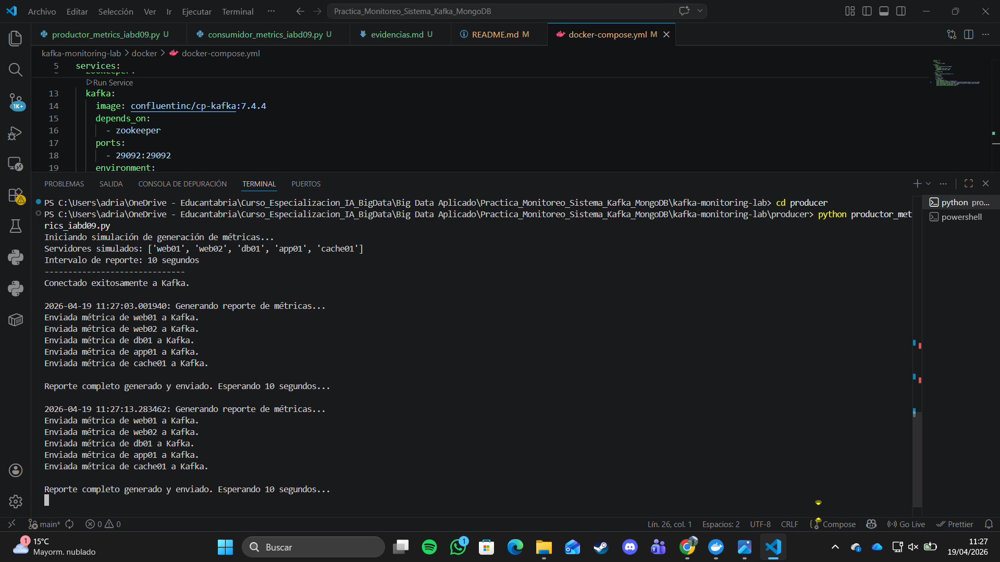
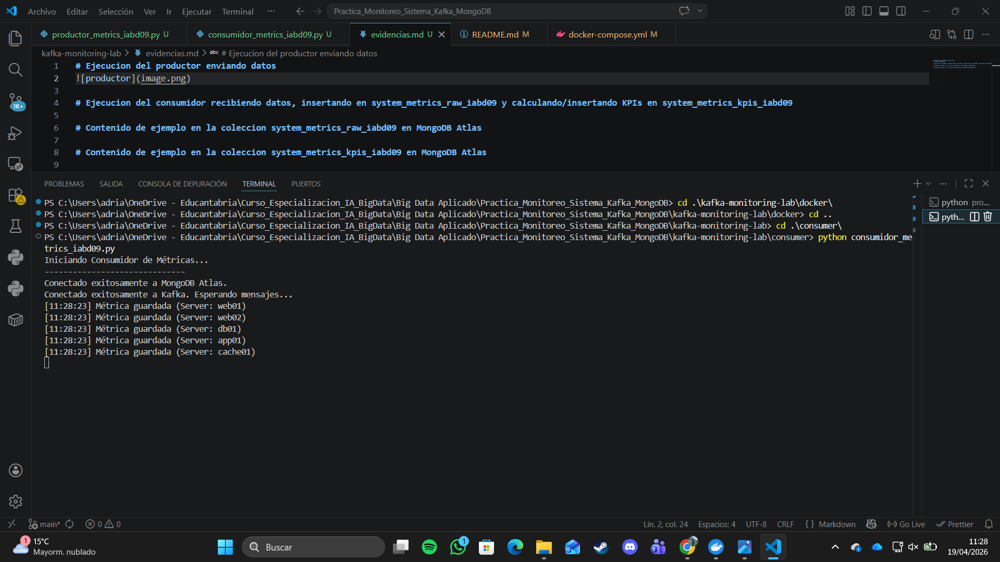
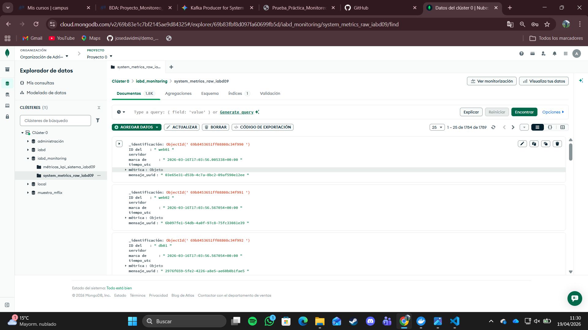
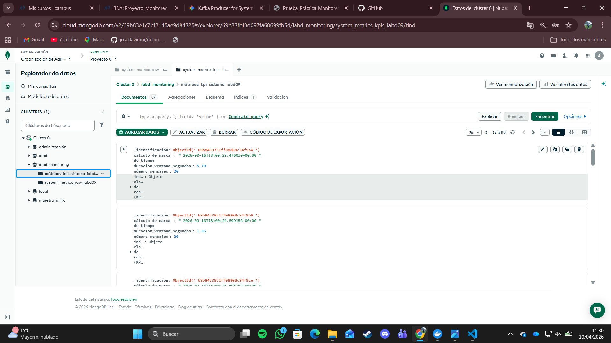

# Ejecucion del productor enviando datos

# Ejecucion del consumidor recibiendo datos, insertando en system_metrics_raw_iabd09 y calculando/insertando KPIs en system_metrics_kpis_iabd09

# Contenido de ejemplo en la coleccion system_metrics_raw_iabd09 en MongoDB Atlas

# Contenido de ejemplo en la coleccion system_metrics_kpis_iabd09 en MongoDB Atlas

